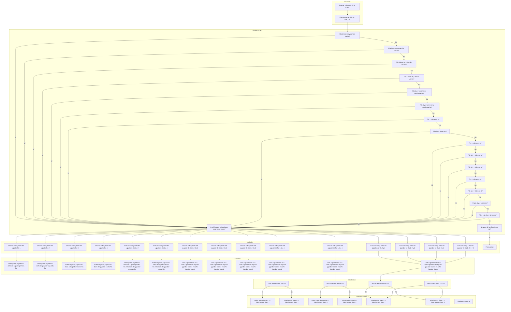

# Project
An original game of football in python

```mermaid
graph TD
    subgraph Inicializar
        A1["Evaluar columnas de la matriz"]
        A2["Filas a evaluar: 22, 66, 154, 198"]
    end

    subgraph Evaluaciones
        B0["A qué jugador o jugadores pertenecen las str?"]
        B1["Fila 1 tiene str y demás vacías?"]
        B2["Fila 2 tiene str y demás vacías?"]
        B3["Fila 3 tiene str y demás vacías?"]
        B4["Fila 4 tiene str y demás vacías?"]
        B5["Fila 1 y 2 tienen str y demás vacías?"]
        B6["Fila 3 y 4 tienen str y demás vacías?"]
        C1["Fila 1 y 4 tienen str?"]
        C2["Fila 2 y 4 tienen str?"]
        C3["Fila 1 y 3 tienen str?"]
        C4["Fila 1, 2 y 4 tienen str?"]
        C5["Fila 1, 3 y 4 tienen str?"]
        C6["Fila 2 y 3 tienen str?"]
        C7["Fila 1, 2 y 3 tienen str?"]
        C8["Fila 2, 3 y 4 tienen str?"]
        C9["Filas 1, 2, 3 y 4 tienen str?"]
        C10["Ninguna de las filas tienen str?"]
    end

    subgraph Calculos
        D1["Calcular vida y daño del jugador fila 1"]
        D2["Calcular vida y daño del jugador fila 2"]
        D3["Calcular vida y daño del jugador fila 3"]
        D4["Calcular vida y daño del jugador fila 4"]
        D5["Calcular vida y daño de jugadores fila 1 y 2"]
        D6["Calcular vida y daño de jugadores fila 3 y 4"]
        E1["Calcular vida y daño del jugador de fila 1 y fila 4"]
        E2["Calcular vida y daño del jugador de fila 2 y fila 4"]
        E3["Calcular vida y daño del jugador de fila 1 y fila 3"]
        E4["Calcular vida y daño del jugador de fila 1, 2 y 4"]
        E5["Calcular vida y daño del jugador de fila 1, 3 y 4"]
        E6["Calcular vida y daño del jugador de fila 2 y 3"]
        E7["Calcular vida y daño del jugador de fila 1, 2 y 3"]
        E8["Calcular vida y daño del jugador de fila 2, 3 y 4"]
        E9["Calcular vida y daño del jugador de fila 1, 2, 3 y 4"]
        E10["Filas vacías"]
    end

    subgraph Acciones
        F1["Goles primer jugador += daño del jugador primera fila"]
        F2["Goles primer jugador += daño del jugador segunda fila"]
        F3["Goles segundo jugador += daño del jugador tercera fila"]
        F4["Goles segundo jugador += daño del jugador cuarta fila"]
        F5["Goles primer jugador += daño del jugador primera fila más daño del jugador segunda fila"]
        F6["Goles segundo jugador += daño del jugador tercera fila más daño del jugador cuarta fila"]
        G1["Vida jugador línea 1 -= Daño jugador línea 4 y vida jugador línea 4 -= daño jugador línea 1"]
        G2["Vida jugador línea 2 -= Daño jugador línea 4 y vida jugador línea 4 -= daño jugador línea 2"]
        G3["Vida jugador línea 1 -= Daño jugador línea 3 y vida jugador línea 4 -= daño jugador línea 3"]
        G4["Vida jugador línea 2 -= Daño jugador línea 4 y vida jugador línea 4 -= daño jugador línea 2"]
        G5["Vida jugador línea 1 -= Daño jugador línea 3 y vida jugador línea 3 -= daño jugador línea 1"]
        G6["Vida jugador línea 2 -= Daño jugador línea 3 y vida jugador línea 3 -= daño jugador línea 2"]

    end

    subgraph Condiciones
        H1["Vida jugador línea 4 <= 0?"]
        H2["Vida jugador línea 1 <=0?"]
        H3["Vida jugador línea 3 <= 0?"]
        H4["Vida jugador línea 2 <= 0?"]
    end

    subgraph Ultimas acciones
        U1["Goles primer jugador += daño jugador línea 1"]
        U2["Vida jugador línea 4 -= daño jugador línea 1"]
        U3["Goles segundo jugador += daño jugador línea 4"]
        U4["Vida jugador linea 1 += daño jugador linea 4"]
        U5["Vida jugador línea 3 -= daño jugador línea 1"]
        U6["Vida jugador línea 2 -= daño jugador línea 4"]
        I["Siguiente columna"]
    end


    A1 --> A2
    A2 --> B1
    B1 -- "Sí" --> B0
    B1 -- "No" --> B2
    B2 -- "Sí" --> B0
    B2 -- "No" --> B3
    B3 -- "Sí" --> B0
    B3 -- "No" --> B4
    B4 -- "Sí" --> B0
    B4 -- "No" --> B5
    B5 -- "Sí" --> B0
    B5 -- "No" --> B6
    B6 -- "Sí" --> B0
    B6 -- "No" --> C1
    C1 -- "Sí" --> B0
    C1 -- "No" --> C2
    C2 -- "Sí" --> B0
    C2 -- "No" --> C3
    C3 -- "Sí" --> B0
    C3 -- "No" --> C4
    C4 -- "Sí" --> B0
    C4 -- "No" --> C5
    C5 -- "Sí" --> B0
    C5 -- "No" --> C6
    C6 -- "Sí" --> B0
    C6 -- "No" --> C7
    C7 -- "Sí" --> B0
    C7 -- "No" --> C8
    C8 -- "Sí" --> B0
    C8 -- "No" --> C9
    C9 -- "Sí" --> B0
    C9 -- "No" --> C10
    C10 -- "Sí" --> E10

    B0 --> D1
    B0 --> D2 
    B0 --> D3
    B0 --> D4
    B0 --> D5
    B0 --> D6
    B0 --> E1
    B0 --> E2
    B0 --> E3
    B0 --> E4
    B0 --> E5
    B0 --> E6
    B0 --> E7
    B0 --> E8
    B0 --> E9

    D1 --> F1
    D2 --> F2
    D3 --> F3
    D4 --> F4
    D5 --> F5
    D6 --> F6

    E1 --> G1
    E2 --> G2
    E3 --> G3
    E4 --> G4
    E5 --> G5
    E6 --> G6
    E7 --> G6
    E8 --> G6
    E9 --> G6

    G4 --> H1
    G5 --> H2
    G6 --> H3
    G6 --> H4

    H1 -- "Sí" --> U1
    H1 -- "No" --> U2
    H2 -- "Sí" --> U3
    H2 -- "No" --> U4
    H3 -- "Sí" --> U5
    H3 -- "No" --> U6
    H4 -- "Sí" --> U5
    H4 -- "Sí" --> U6

    

```
