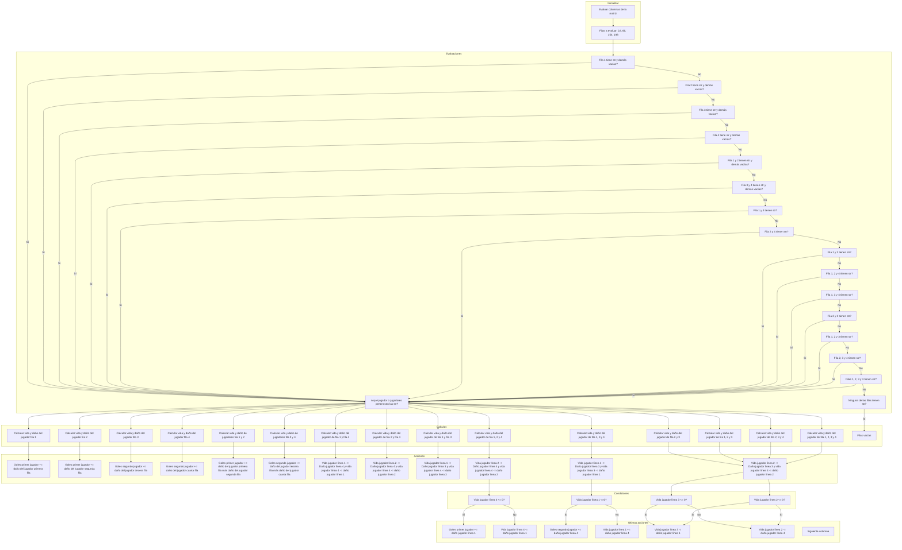

# Project
```ruby
from Equipos.Barcelona import *
from Equipos.Real_madri import *


def elegir_equipo(jugador: str) -> dict:
    """
    Función para elegir el equipo de fútbol.
    
    Args:
    jugador (str): El nombre del jugador que elige el equipo.
    
    Returns:
    dict: Un diccionario con la información del equipo elegido.
    """
    
    while True:
        try:
            print(f"| 1 : Barca |\n| 2: Real Madrid |")
            seleccion = int(input(f"{jugador}, ¿Cuál equipo desea escoger?: "))
            if 1 <= seleccion <= 2:
                break
            else:
                print("ERROR, escoja nuevamente.")
        except ValueError:
            print("Entrada no válida. Por favor, ingrese un número.")
    
    equipo_seleccionado = teams.get(seleccion)
    if equipo_seleccionado:
        print("Escudo del equipo:")
        for linea in equipo_seleccionado["escudo"]:
            print(linea)
    
    jugadores = equipo_seleccionado["jugadores"]
    ataque = equipo_seleccionado["ataque"]
    defensa = equipo_seleccionado["defensa"]
    costo = equipo_seleccionado["costo"]

    return jugadores, ataque, defensa, costo

def elegir_modo_juego() -> int:
    """
    Función para elegir el modo de juego.
    
    Returns:
    int: El número de rondas del juego.
    """
    
    while True:
        try:
            modo = int(input("Escoja un modo de juego (1, 2, 3): "))
            if 1 <= modo <= 3:
                rondas = {1: 9, 2: 12, 3: 15}[modo]
                return rondas
            else:
                print("ERROR, escoja nuevamente.")
        except ValueError:
            print("Entrada no válida. Por favor, ingrese un número.")


def evaluar_columna(fila_p1, columna_p1, fila_p2, columna_p2, numero_jugador_escogido, numero_segundo_escogido) -> int:
    """
    Función para evaluar una columna.
    
    Args:
    columna (int): La columna que se evaluará.
    columnas_uno (list): La lista de columnas del jugador 1.
    columnas_dos (list): La lista de columnas del jugador 2.
    goles_p1 (int): Los goles del jugador 1.
    goles_p2 (int): Los goles del jugador 2.
    
    Returns:
    int, int: Los goles del jugador 1 y del jugador 2 después de evaluar la columna.
    """
    columnas_uno = [[], [], [], []]
    columnas_dos = [[], [], [], []]

    if fila_p1 == 1 and columna_p1 == 1:
        columnas_uno[0].insert(0, numero_jugador_escogido)
    elif fila_p1 == 2 and columna_p1 == 1:
        columnas_uno[0].insert(-1, numero_jugador_escogido)
    elif fila_p1 == 1 and columna_p1 == 2:
        columnas_uno[1].insert(0, numero_jugador_escogido)
    elif fila_p1 == 2 and columna_p1 == 2:
        columnas_uno[1].insert(-1, numero_jugador_escogido)
    elif fila_p1 == 1 and columna_p1 == 3:
        columnas_uno[2].insert(0, numero_jugador_escogido)
    elif fila_p1 == 2 and columna_p1 == 3:
        columnas_uno[2].insert(-1, numero_jugador_escogido)
    elif fila_p1 == 1 and columna_p1 == 4:
        columnas_uno[3].insert(0, numero_jugador_escogido)
    elif fila_p1 == 2 and columna_p1 == 4:
        columnas_uno[3].insert(-1, numero_jugador_escogido)
        
    elif fila_p2 == 4 and columna_p2 == 1:
        columnas_dos[0].insert(0, numero_segundo_escogido)
    elif fila_p2 == 5 and columna_p2 == 1:
        columnas_dos[0].insert(-1, numero_segundo_escogido)
    elif fila_p2 == 4 and columna_p2 == 2:
        columnas_dos[1].insert(0, numero_segundo_escogido)
    elif fila_p2 == 5 and columna_p2 == 2:
        columnas_dos[1].insert(-1, numero_segundo_escogido)
    elif fila_p2 == 4 and columna_p2 == 3:
        columnas_dos[2].insert(0, numero_segundo_escogido)
    elif fila_p2 == 5 and columna_p2 == 3:
        columnas_dos[2].insert(-1, numero_segundo_escogido)
    elif fila_p2 == 4 and columna_p2 == 4:
        columnas_dos[3].insert(0, numero_segundo_escogido)
    elif fila_p2 == 5 and columna_p2 == 4:
        columnas_dos[3].insert(-1, numero_segundo_escogido)

    goles_p1 : int = 0
    goles_p2 : int = 0
    actualizar_matriz = 44
    columna_evaluada = 0
    while columna_evaluada < 4 and not 0 == columnas_uno[0] == columnas_uno[1] == columnas_uno[2] == columnas_uno[3] == columnas_dos[0] == columnas_dos[1] == columnas_dos[2] == columnas_dos[3]:
        
        # Casos donde solo hay un jugador en la columna
        if len(columnas_uno[columna_evaluada]) == 1 and len(columnas_dos[columna_evaluada]) == 0:
            goles_p1 += ataque_jugadores_p1[columnas_uno[columna_evaluada][0]]

        elif len(columnas_dos[columna_evaluada]) == 1 and len(columnas_uno[columna_evaluada]) == 0:
            goles_p2 += ataque_jugadores_p2[columnas_dos[columna_evaluada][0]]

        # Casos donde hay dos jugadores del miso equipo en una columna
        elif len(columnas_uno[columna_evaluada]) == 2 and len(columnas_dos[columna_evaluada]) == 0:
            goles_p1 += ataque_jugadores_p1[columnas_uno[columna_evaluada][0]] + ataque_jugadores_p1[columnas_uno[columna_evaluada[1]]]

        elif len(columnas_dos[columna_evaluada]) == 2 and len(columnas_uno[columna_evaluada]) == 0:
            goles_p2 += ataque_jugadores_p2[columnas_dos[columna_evaluada][0]] + ataque_jugadores_p2[columnas_dos[columna_evaluada[1]]]


        # CASOS DONDE HAY UN JUGADOR DE UN EQUIPO Y DOS DE OTRO EN UNA MISMA COLUMNA

        # Dos jugadores del primer equipo y uno del segundo equipo
        elif len(columnas_uno[columna_evaluada]) == 2 and len(columnas_dos[columna_evaluada]) == 1:
            
            defensa_jugadores_p1[columnas_uno[columna_evaluada][1]] -= ataque_jugadores_p2[columnas_dos[columna_evaluada][0]]
            if defensa_jugadores_p1[columnas_uno[columna_evaluada][1]] <=  0:
                columnas_uno[columna_evaluada].pop(1)
                for i in range(actualizar_matriz):
                    matriz_visual[(actualizar_matriz) + i][columna_evaluada] = " " * 100

            defensa_jugadores_p2[columnas_dos[columna_evaluada][0]] -= ataque_jugadores_p1[columnas_uno[columna_evaluada][1]]
            if defensa_jugadores_p2[columnas_dos[columna_evaluada][0]] <= 0:
                columnas_dos[columna_evaluada].pop(0)
                goles_p1 += ataque_jugadores_p1[columnas_uno[columna_evaluada][0]]
                for i in range(actualizar_matriz * 2):
                    matriz_visual[(actualizar_matriz * 3) + i][columna_evaluada] = " " * 100
            else:
                defensa_jugadores_p2[columnas_dos[columna_evaluada][0]] -= ataque_jugadores_p1[columnas_uno[columna_evaluada][0]]
                if defensa_jugadores_p2[columnas_dos[columna_evaluada][0]] <= 0:
                    columnas_dos[columna_evaluada].pop(0)
                    for i in range(actualizar_matriz * 2):
                        matriz_visual[(actualizar_matriz * 3) + i][columna_evaluada] = " " * 100

        # Dos jugadores del segundo equipo y uno del primer equipo
        elif len(columnas_dos[columna_evaluada]) == 2 and len(columnas_uno[columna_evaluada]) == 1:
            defensa_jugadores_p2[columnas_dos[columna_evaluada][0]] -= ataque_jugadores_p1[columnas_uno[columna_evaluada][0]]
            if defensa_jugadores_p2[columnas_dos[columna_evaluada][0]] <= 0:
                columnas_dos[columna_evaluada].pop(0)
                for i in range(actualizar_matriz):
                    matriz_visual[(actualizar_matriz * 3) + i][columna_evaluada] = " " * 100

            defensa_jugadores_p1[columnas_uno[columna_evaluada][0]] -= ataque_jugadores_p2[columnas_dos[columna_evaluada][0]]
            if defensa_jugadores_p1[columnas_uno[columna_evaluada][0]] <= 0:
                columnas_uno[columna_evaluada].pop(0)
                goles_p2 += ataque_jugadores_p2[columnas_dos[columna_evaluada][1]]
                for i in range(actualizar_matriz * 2):
                    matriz_visual[(actualizar_matriz * 0) + i][columna_evaluada] = " " * 100
            else:
                defensa_jugadores_p1[columnas_uno[columna_evaluada][0]] -= ataque_jugadores_p2[columnas_dos[columna_evaluada][1]]
                if defensa_jugadores_p1[columnas_uno[columna_evaluada][0]] <= 0:
                    columnas_uno[columna_evaluada].pop(0)
                    for i in range(actualizar_matriz * 2):
                        matriz_visual[(actualizar_matriz * 0) + i][columna_evaluada] = " " * 100


        # CASOS DONDE HAY JUGADORES EN TODA LA COLUMNA  
        elif len(columnas_uno[columna_evaluada]) == 2 and len(columnas_dos[columna_evaluada]) == 2:

            defensa_jugadores_p2[columnas_dos[columna_evaluada][0]] -= ataque_jugadores_p1[columnas_uno[columna_evaluada][1]]
            defensa_jugadores_p1[columnas_uno[columna_evaluada][1]] -= ataque_jugadores_p2[columnas_dos[columna_evaluada][0]]

            if defensa_jugadores_p2[columnas_dos[columna_evaluada][0]] <= 0:
                columnas_dos[columna_evaluada].pop(0)
                for i in range(actualizar_matriz):
                    matriz_visual[(actualizar_matriz * 3) + i][columna_evaluada] = " " * 100
                defensa_jugadores_p2[columnas_dos[columna_evaluada][1]] -= ataque_jugadores_p1[columnas_uno[columna_evaluada][0]]
                if defensa_jugadores_p2[columnas_dos[columna_evaluada][1]] <= 0:
                    columnas_dos[columna_evaluada].pop(1)
                    for i in range(actualizar_matriz):
                        matriz_visual[(actualizar_matriz * 4) + i][columna_evaluada] = " " * 100

            elif defensa_jugadores_p2[columnas_dos[columna_evaluada][0]] > 0:
                defensa_jugadores_p2[columnas_dos[columna_evaluada][0]] -= ataque_jugadores_p1[columnas_uno[columna_evaluada][0]]
                if defensa_jugadores_p2[columnas_dos[columna_evaluada][0]] <= 0:
                    columnas_dos[columna_evaluada].pop(0)
                    for i in range(actualizar_matriz):
                        matriz_visual[(actualizar_matriz * 3) + i][columna_evaluada] = " " * 100

            elif defensa_jugadores_p1[columnas_uno[columna_evaluada][1]] <= 0:
                columnas_uno[columna_evaluada].pop(1)
                for i in range(actualizar_matriz):
                    matriz_visual[(actualizar_matriz) + i][columna_evaluada] = " " * 100
                defensa_jugadores_p1[columnas_uno[columna_evaluada][0]] -= ataque_jugadores_p2[columnas_dos[columna_evaluada][1]]
                if defensa_jugadores_p1[columnas_uno[columna_evaluada][0]] <= 0:
                    columnas_uno[columna_evaluada].pop(0)
                    for i in range(actualizar_matriz):
                        matriz_visual[(actualizar_matriz * 0) + i][columna_evaluada] = " " * 100

            elif defensa_jugadores_p1[columnas_uno[columna_evaluada][1]] > 0:
                defensa_jugadores_p1[columnas_uno[columna_evaluada][1]] -= ataque_jugadores_p2[columnas_dos[columna_evaluada][1]]
                if defensa_jugadores_p1[columnas_uno[columna_evaluada][1]] <= 0:
                    columnas_uno[columna_evaluada].pop(1)
                    for i in range(actualizar_matriz):
                        matriz_visual[(actualizar_matriz) + i][columna_evaluada] = " " * 100

        columna_evaluada += 1

    return goles_p1, goles_p2

# Bucle de juego por rondas
if __name__ == "__main__":
    
    teams = {
        1: barcelona,
        2: real_madrid
    }

    jugadores_p1, ataque_jugadores_p1, defensa_jugadores_p1, costo_jugadores_p1 = elegir_equipo("Jugador 1")
    jugadores_p2, ataque_jugadores_p2, defensa_jugadores_p2, costo_jugadores_p2 = elegir_equipo("Jugador 2")
    rondas_totales = elegir_modo_juego()
    goles_primer_jugador, goles_segundo_jugador = evaluar_columna(jugadores_p1, ataque_jugadores_p1, defensa_jugadores_p1, jugadores_p2, ataque_jugadores_p2, defensa_jugadores_p2)

    matriz_visual = [[" " * 100 for _ in range(5)] for _ in range(226)]
    talentos_jugador_1 : int = 1
    talentos_jugador_2 : int = 1
    ronda = 1
    while ronda <= rondas_totales:
        ronda : int = 1
        print(f"--- Ronda {ronda} ---")
        # Turno del jugador 1
        print("--- Turno del primer jugador ---")
        print(f"-- GOLES P1-- {goles_primer_jugador}")
        print(f"-- GOLES P2-- {goles_segundo_jugador}")
        print(f"-- CREDITOS -- {talentos_jugador_1}")
        numero_jugador_escogido = 100
        while numero_jugador_escogido != 0:
            try:
                numero_jugador_escogido = int(input("Jugador 1, ingresa el dorsal del jugador (0 para continuar): "))
                if numero_jugador_escogido == 0:
                    break
                if numero_jugador_escogido not in jugadores_p1:
                    print("Dorsal inválido, intenta de nuevo.")
                    continue
                
                if talentos_jugador_1 >= costo_jugadores_p1[numero_jugador_escogido]:
                    jugador_escogido = jugadores_p1[numero_jugador_escogido]
                    talentos_jugador_1 -= costo_jugadores_p1[numero_jugador_escogido]
                else:
                    print("No tienes suficientes talentos. Elige otro jugador.")
                    continue
            except ValueError:
                print("Entrada inválida. Debe ser un número.")

            # Solicitar fila y columna
            try:
                fila_p1 = int(input("En qué fila (1-2): "))
                while fila_p1 not in [1, 2]:
                    fila_p1 = int(input("ERROR, ingrese una fila válida (1-2): "))

                columna_p1 = int(input("En qué columna (1-4): "))
                while columna_p1 not in [1, 2, 3, 4]:
                    columna_p1 = int(input("ERROR, ingrese una columna válida (1-4): "))
            except ValueError:
                print("Entrada inválida. Deben ser números.")

            filas_p1 = (fila_p1 - 1) * 44

            for i in range(len(jugador_escogido)):
                if filas_p1 + i < len(matriz_visual):
                    matriz_visual[filas_p1 + i][columna_p1] = jugador_escogido[i]

            for r in matriz_visual:
                print("".join(r))

        # Turno del jugador 2
        print("--- Turno del segundo jugador ---")
        print(f"-- GOLES P1-- {goles_primer_jugador}")
        print(f"-- GOLES P2-- {goles_segundo_jugador}")
        print(f"-- CREDITOS -- {talentos_jugador_2}")
        numero_segundo_escogido = 100
        while numero_segundo_escogido != 0:
            try:
                numero_segundo_escogido = int(input("Jugador 2, ingresa el dorsal del jugador (0 para continuar): "))
                if numero_segundo_escogido == 0:
                    break
                if numero_segundo_escogido not in jugadores_p2:
                    print("Dorsal inválido, intenta de nuevo.")
                    continue
                
                if talentos_jugador_2 >= costo_jugadores_p2[numero_segundo_escogido]:
                    segundo_escogido = jugadores_p2[numero_segundo_escogido]
                    talentos_jugador_2 -= costo_jugadores_p2[numero_segundo_escogido]
                else:
                    print("No tienes suficientes talentos. Elige otro jugador.")
                    continue
            except ValueError:
                print("Entrada inválida. Debe ser un número.")

            # Solicitar fila y columna
            try:
                fila_p2 = int(input("En qué fila (4-5): "))
                while fila_p2 not in [4, 5]:
                    fila_p2 = int(input("ERROR, ingrese una fila válida (4-5): "))

                columna_p2 = int(input("En qué columna (1-4): "))
                while columna_p2 not in [1, 2, 3, 4]:
                    columna_p2 = int(input("ERROR, ingrese una columna válida (1-4): "))
            except ValueError:
                print("Entrada inválida. Deben ser números.")

            filas_p2 = (fila_p2 - 1) * 44

            for i in range(len(segundo_escogido)):
                if filas_p2 + i < len(matriz_visual):
                    matriz_visual[filas_p2 + i][columna_p2] = segundo_escogido[i]

            for r in matriz_visual:
                print("".join(r))

        goles_primer_jugador, goles_segundo_jugador = evaluar_columna(fila_p1, fila_p2, columna_p1, columna_p2, numero_jugador_escogido, numero_segundo_escogido)
        ronda += 1
        talentos_jugador_1 += ronda
        talentos_jugador_2 += ronda

    for r in matriz_visual:
        print("".join(r))

```
Explicación del código y diagramas de flujo
Este código representa un juego basado en la elección de equipos de fútbol (Barcelona y Real Madrid) y la evaluación de sus jugadores durante un número específico de rondas. Se basa en la interacción entre jugadores y las decisiones tomadas en cada ronda, como seleccionar equipos y jugadores, evaluar sus ataques y defensas, y calcular el marcador.

1. Importación de módulos
ruby
Copiar código
from Equipos.Barcelona import *
from Equipos.Real_madri import *
Aquí se importan los módulos Barcelona y Real_madri, que probablemente contienen información y funcionalidades relacionadas con estos equipos. La estructura sugiere que estos módulos contienen información sobre jugadores, atributos de ataque, defensa, y costo.

Diagrama de flujo (simplificado):

```mermaid
graph TD
    A[Inicio] --> B[Importar Equipos]
    B --> C[Barcelona]
    B --> D[Real Madrid]
    C --> E[Datos de jugadores y atributos]
    D --> E
````
2. Función elegir_equipo
```ruby
def elegir_equipo(jugador: str) -> dict:
Esta función permite a cada jugador seleccionar entre dos equipos: Barcelona o Real Madrid. El equipo elegido se devuelve como un diccionario que contiene los jugadores y sus atributos (ataque, defensa, costo).
````
Diagrama de flujo para elegir_equipo:

```mermaid
graph TD
    A[Inicio] --> B[Mostrar Opciones de Equipos]
    B --> C{Selecciona un equipo}
    C -->|1| D[Elegir Barcelona]
    C -->|2| E[Elegir Real Madrid]
    D --> F[Mostrar escudo del equipo]
    E --> F
    F --> G[Devolver jugadores, ataque, defensa, costo]
```
3. Función elegir_modo_juego
```ruby
Copiar código
def elegir_modo_juego() -> int:
Esta función permite a los jugadores elegir entre tres modos de juego, cada uno con un número diferente de rondas (9, 12 o 15).
```
Diagrama de flujo para elegir_modo_juego:

```mermaid
Copiar código
graph TD
    A[Inicio] --> B[Mostrar Modos de Juego]
    B --> C{Selecciona un modo}
    C -->|1| D[Número de rondas: 9]
    C -->|2| E[Número de rondas: 12]
    C -->|3| F[Número de rondas: 15]
    D --> G[Devolver rondas]
    E --> G
    F --> G
```
4. Función evaluar_columna
```ruby
Copiar código
def evaluar_columna(fila_p1, columna_p1, fila_p2, columna_p2, numero_jugador_escogido, numero_segundo_escogido) -> int:
````
Esta función evalúa una columna de la matriz de juego, en la que los jugadores colocan sus jugadores seleccionados. Dependiendo de la columna y las posiciones de los jugadores, se calculan los goles para cada equipo.

Diagrama de flujo para evaluar_columna:

```mermaid
Copiar código
graph TD
    A[Inicio] --> B[Evaluar posiciones]
    B --> C{Hay jugadores en la columna?}
    C -->|No| D[Termina evaluación]
    C -->|Sí| E{Evaluar ataques y defensas}
    E -->|Gana P1| F[Sumar goles a P1]
    E -->|Gana P2| G[Sumar goles a P2]
    F --> H[Actualizar matriz visual]
    G --> H
    H --> I[Devolver goles]
```
5. Bucle principal del juego
```ruby
Copiar código
if __name__ == "__main__":
Este es el bucle principal del juego. Después de que los equipos son seleccionados y el modo de juego es elegido, se realiza el bucle por rondas, donde cada jugador escoge sus jugadores y se evalúan los resultados de los enfrentamientos.
```
Diagrama de flujo para el bucle principal:

mermaid
Copiar código
graph TD
    A[Inicio del juego] --> B[Elegir equipo P1 y P2]
    B --> C[Elegir modo de juego]
    C --> D[Iniciar rondas]
    D --> E{Turno del jugador 1}
    E -->|Escoge jugador| F[Evaluar columna]
    F --> G[Actualizar goles]
    G --> H{Turno del jugador 2}
    H -->|Escoge jugador| F
    G --> I[Fin de ronda]
    I --> J{Más rondas?}
    J -->|Sí| D
    J -->|No| K[Mostrar resultados finales]
    K --> L[Fin del juego]
Este diseño divide el código en bloques bien definidos, donde cada función tiene un propósito claro. El uso de diagramas de flujo ayuda a visualizar cómo se toman las decisiones en cada paso del juego, desde la selección de equipos hasta la evaluación de las columnas de juego y el cálculo del marcador.

