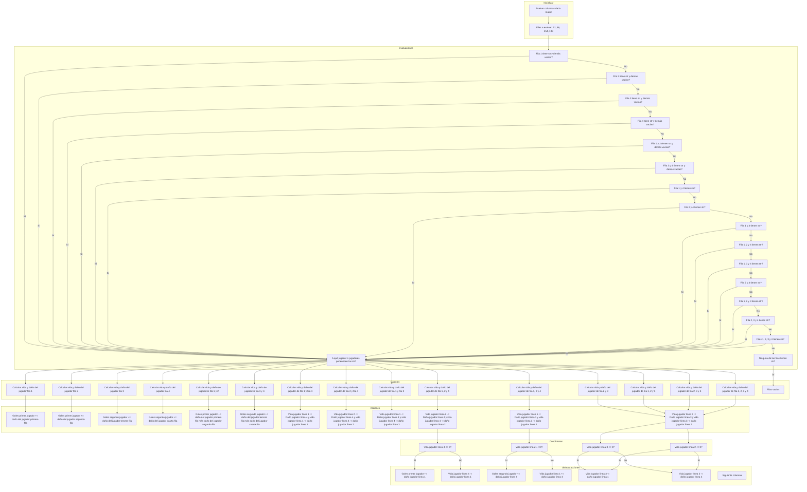

# Project

Explicación del código y diagramas de flujo
Este código representa un juego basado en la elección de equipos de fútbol (Barcelona y Real Madrid) y la evaluación de sus jugadores durante un número específico de rondas. Se basa en la interacción entre jugadores y las decisiones tomadas en cada ronda, como seleccionar equipos y jugadores, evaluar sus ataques y defensas, y calcular el marcador.

1. Importación de módulos
ruby
Copiar código
from Equipos.Barcelona import *
from Equipos.Real_madri import *
Aquí se importan los módulos Barcelona y Real_madri, que probablemente contienen información y funcionalidades relacionadas con estos equipos. La estructura sugiere que estos módulos contienen información sobre jugadores, atributos de ataque, defensa, y costo.

Diagrama de flujo (simplificado):

```mermaid
graph TD
    A[Inicio] --> B[Importar Equipos]
    B --> C[Barcelona]
    B --> D[Real Madrid]
    C --> E[Datos de jugadores y atributos]
    D --> E
````
2. Función elegir_equipo
```ruby
def elegir_equipo(jugador: str) -> dict:
Esta función permite a cada jugador seleccionar entre dos equipos: Barcelona o Real Madrid. El equipo elegido se devuelve como un diccionario que contiene los jugadores y sus atributos (ataque, defensa, costo).
````
Diagrama de flujo para elegir_equipo:

```mermaid
graph TD
    A[Inicio] --> B[Mostrar Opciones de Equipos]
    B --> C{Selecciona un equipo}
    C -->|1| D[Elegir Barcelona]
    C -->|2| E[Elegir Real Madrid]
    D --> F[Mostrar escudo del equipo]
    E --> F
    F --> G[Devolver jugadores, ataque, defensa, costo]
```
3. Función elegir_modo_juego
```ruby
Copiar código
def elegir_modo_juego() -> int:
Esta función permite a los jugadores elegir entre tres modos de juego, cada uno con un número diferente de rondas (9, 12 o 15).
```
Diagrama de flujo para elegir_modo_juego:

```mermaid
Copiar código
graph TD
    A[Inicio] --> B[Mostrar Modos de Juego]
    B --> C{Selecciona un modo}
    C -->|1| D[Número de rondas: 9]
    C -->|2| E[Número de rondas: 12]
    C -->|3| F[Número de rondas: 15]
    D --> G[Devolver rondas]
    E --> G
    F --> G
```
4. Función evaluar_columna
```ruby
Copiar código
def evaluar_columna(fila_p1, columna_p1, fila_p2, columna_p2, numero_jugador_escogido, numero_segundo_escogido) -> int:
````
Esta función evalúa una columna de la matriz de juego, en la que los jugadores colocan sus jugadores seleccionados. Dependiendo de la columna y las posiciones de los jugadores, se calculan los goles para cada equipo.

Diagrama de flujo para evaluar_columna:

```mermaid
Copiar código
graph TD
    A[Inicio] --> B[Evaluar posiciones]
    B --> C{Hay jugadores en la columna?}
    C -->|No| D[Termina evaluación]
    C -->|Sí| E{Evaluar ataques y defensas}
    E -->|Gana P1| F[Sumar goles a P1]
    E -->|Gana P2| G[Sumar goles a P2]
    F --> H[Actualizar matriz visual]
    G --> H
    H --> I[Devolver goles]
```
5. Bucle principal del juego
```ruby
Copiar código
if __name__ == "__main__":
Este es el bucle principal del juego. Después de que los equipos son seleccionados y el modo de juego es elegido, se realiza el bucle por rondas, donde cada jugador escoge sus jugadores y se evalúan los resultados de los enfrentamientos.
```
Diagrama de flujo para el bucle principal:

mermaid
Copiar código
graph TD
    A[Inicio del juego] --> B[Elegir equipo P1 y P2]
    B --> C[Elegir modo de juego]
    C --> D[Iniciar rondas]
    D --> E{Turno del jugador 1}
    E -->|Escoge jugador| F[Evaluar columna]
    F --> G[Actualizar goles]
    G --> H{Turno del jugador 2}
    H -->|Escoge jugador| F
    G --> I[Fin de ronda]
    I --> J{Más rondas?}
    J -->|Sí| D
    J -->|No| K[Mostrar resultados finales]
    K --> L[Fin del juego]
Este diseño divide el código en bloques bien definidos, donde cada función tiene un propósito claro. El uso de diagramas de flujo ayuda a visualizar cómo se toman las decisiones en cada paso del juego, desde la selección de equipos hasta la evaluación de las columnas de juego y el cálculo del marcador.

